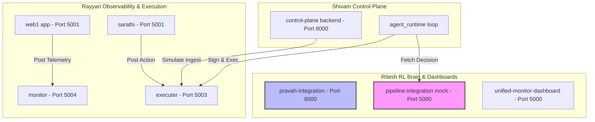
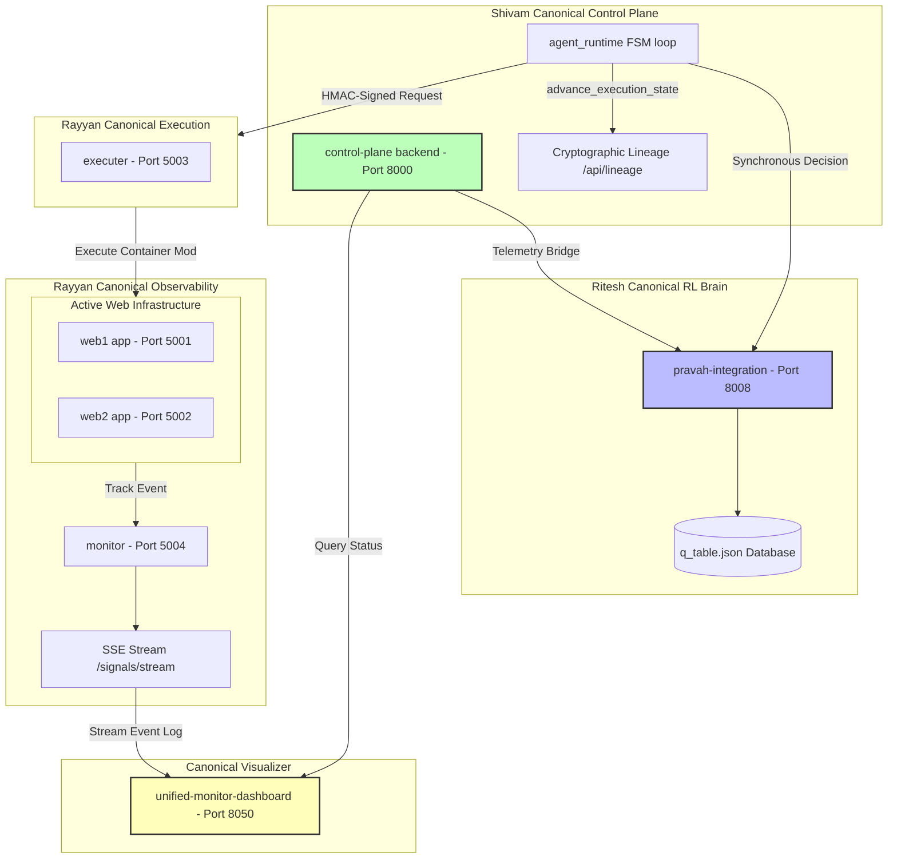

 # PRAVAH ECOSYSTEM: FULL CONVERGENCE MAP

This document details the convergence roadmap across the systems built by Rayyan, Ritesh, and Shivam. It analyzes code integration points, matches schemas, resolves runtime assumptions, and maps the before/after topologies of the unified Pravah architecture.

---

## 1. Inventory & Ownership Mapping

### What Rayyan Built (Execution & Observability Stream)
1. **[reliability-controller2-main](file:///c:/Users/black/OneDrive/Desktop/Pravah/BHIV/reliability-controller2-main):** Comprises the target Flask apps (`web1` on port `5001`, `web2` on port `5002`), the `monitor` event aggregator (port `5004` / `/track-event`), the `sarathi` decision gateway (port `5005:5001` / `/decision`), and the `executer` container manager (port `5003` / `/execute-action`).
2. **[monitoring-service-main](file:///c:/Users/black/OneDrive/Desktop/Pravah/BHIV/monitoring-service-main):** Basic Flask app (port `5000`) with an in-memory daemon checking a `failure_state` boolean for self-healing tests.
3. **[reliability-controller-main](file:///c:/Users/black/OneDrive/Desktop/Pravah/BHIV/reliability-controller-main):** A broken Flask prototype skeleton that lacks core files (`state.py`, `detector.py`, `decision.py`) and is unusable.
* **Core Contracts:** Header-based caller verification (`X-CALLER: sarathi`), strict trace aggregation (`X-TRACE-ID`), and real-time Server-Sent Events (SSE) `/signals/stream` validated by [signal_schema.json](file:///c:/Users/black/OneDrive/Desktop/Pravah/BHIV/reliability-controller2-main/monitor/signal_schema.json).
* **Assumptions:** Assumes target services propagate headers down HTTP chains and that Docker/Kubernetes commands (`docker restart`, `kubectl`) can be executed locally via subprocess.

### What Ritesh Built (Enforcement, RL Decision Engine, & Dashboards)
1. **[pravah-integration.py-main](file:///c:/Users/black/OneDrive/Desktop/Pravah/BHIV/pravah-integration.py-main):** Production-ready RL engine implementing JSON-based Q-table persistence ([q_table_store.py](file:///c:/Users/black/OneDrive/Desktop/Pravah/BHIV/pravah-integration.py-main/rl/q_table_store.py) -> `data/q_table.json`), state encoders, delta-based rewards, action guards, and a FastAPI background autonomy loop.
2. **[decision-brain-cp.py-main](file:///c:/Users/black/OneDrive/Desktop/Pravah/BHIV/decision-brain-cp.py-main):** RL decision prototype featuring an in-memory Q-table, safety guards, and standalone loop scripts.
3. **[SAARTHI-ENFORCEMENT.PY-main](file:///c:/Users/black/OneDrive/Desktop/Pravah/BHIV/SAARTHI-ENFORCEMENT.PY-main) & [saartthi-integration.py-main](file:///c:/Users/black/OneDrive/Desktop/Pravah/BHIV/saartthi-integration.py-main):** Duplicate enforcement PoCs exposing a uvicorn tri-service setup (`sarathi` on `8000`, `executer` on `8001`, `core` on `8002`) where the executer rejects bypass requests.
4. **[pipeline-integration-py-main](file:///c:/Users/black/OneDrive/Desktop/Pravah/BHIV/pipeline-integration-py-main):** Flask server (port `5000`) serving mock decisions (`/process-runtime`) used as an integration bridge in local tests.
5. **[UNIFIED-DASHBOARD.PY-main](file:///c:/Users/black/OneDrive/Desktop/Pravah/BHIV/UNIFIED-DASHBOARD.PY-main) & [unified-monitor-dashboard-main](file:///c:/Users/black/OneDrive/Desktop/Pravah/BHIV/unified-monitor-dashboard-main):** Duplicate dashboards. Expose dark-theme HTML visualization pages on port `5000` showing CPU/Memory bars and logs.
* **Core Contracts:** Deterministic Q-table updates, environment action gates (Prod/Stage/Dev restrictions), and `X-CALLER` header checks.
* **Assumptions:** Assumes telemetry numbers are scaled to percentages (e.g. `0.0` - `100.0`) and that in-memory stores are sufficient unless JSON persistence is explicitly loaded.

### What Shivam Built (Control Plane & Cryptographic Ledger)
1. **[multi-agent-control-plane-main](file:///c:/Users/black/OneDrive/Desktop/Pravah/BHIV/multi-agent-control-plane-main):** Unified control plane. Exposes a FastAPI management app (port `8000`), a Redis event bus (port `6379`), scaling agents, and Streamlit panels.
2. **[agent_runtime.py](file:///c:/Users/black/OneDrive/Desktop/Pravah/BHIV/multi-agent-control-plane-main/agent_runtime.py):** Autonomous orchestration engine running a continuous FSM loop (*sense → validate → decide → enforce → act → observe → explain*).
* **Core Contracts:** Cryptographic execution lineage validators ([execution_contract.py](file:///c:/Users/black/OneDrive/Desktop/Pravah/BHIV/multi-agent-control-plane-main/contracts/execution_contract.py)), enforcing state transition prerequisites (Phase 4 Semantic Validator: `CREATED` -> `APPROVED` -> `EXECUTED` -> `COMPLETED`). Requests to executors are signed with HMAC-SHA256.
* **Assumptions:** Assumes a sequential state-machine lifecycle (`idle`, `observing`, etc.) where progress can be verified via hash chains.

---

## 2. Overlap & Duplication Matrix

| Feature Area | Overlapping/Duplicate Repositories | Core Duplication |
| :--- | :--- | :--- |
| **Dashboards / UIs** | `pipeline-integration-py-main`, `UNIFIED-DASHBOARD.PY-main`, `unified-monitor-dashboard-main`, `multi-agent-control-plane-main/dashboard` | Five distinct UI files running Flask or Streamlit on ports `5000`/`8501`, replicating layout and telemetry parsing. |
| **Enforcement Layers** | `SAARTHI-ENFORCEMENT.PY-main`, `saartthi-integration.py-main`, `reliability-controller2-main/sarathi` | Replicated `sarathi` apps verifying `trace_id` structures and checking header identity (`X-CALLER`). |
| **RL Decision Logic** | `decision-brain-cp.py-main`, `pravah-integration.py-main` | Identical state encoding thresholds and Q-table math implemented twice. |
| **Telemetries / Simulators** | `reliability-controller2-main/web1`, `pipeline-integration-py-main/dashboard.py` | Both write mock CPU spikes, health score drops, and response times to JSON files or standard output. |
| **Executor Services** | `reliability-controller2-main/executer`, nested `multi-agent-control-plane-main/reliability-controller2-main/executer` | Duplicate subdirectories of Rayyan's execution server. |

---

## 3. Architectural Divergences
1. **Security & Gating:** Rayyan and Ritesh utilize basic, unauthenticated HTTP headers (`X-CALLER: sarathi`) to authorise executions. Shivam’s control plane uses **cryptographic HMAC-SHA256 signatures** (`X-Service-Signature`, `X-Service-Timestamp`, `X-Service-Nonce`) which are validated at the API boundary.
2. **Autonomy Execution:** Ritesh runs a background async task lifespan to reconciliate states. Shivam uses a state-machine model that tracks states in JSON files (`logs/agent/agent_state_{id}.json`), allowing crash recovery.
3. **Q-Table Persistence:** Ritesh’s `pravah-integration` writes updates directly to a JSON database (`data/q_table.json`). `decision-brain-cp` keeps data strictly in RAM, meaning updates are lost on restart.

---

## 4. Contract Mismatches & Schema Drift

### Telemetry Schema Drift
* **Shivam CP backend expects:**
  ```json
  {
    "service_id": "web1",
    "metrics": { "cpu": 0.95, "memory": 0.83, "error_rate": 0.0, "uptime": 12345 }
  }
  ```
  *(Note that metrics are fractionals between `0.0` and `1.0`)*
* **Ritesh RL Brain expects:**
  ```json
  {
    "deployment_id": "svc-01",
    "cpu_percent": 95.0,
    "memory_percent": 83.0,
    "health_score": 1.0,
    "restart_count": 0,
    "crashed": false
  }
  ```
  *(Note that metrics are percentage scales between `0.0` and `100.0`)*

### Decision Endpoint Contract Mismatch
* Shivam’s `agent_runtime.py` POSTs to `/process-runtime` expecting:
  ```json
  { "action_requested": "restart", "confidence": 1.0, "reason": "health_check_failed" }
  ```
* Ritesh’s persistent `pravah-integration` FastAPI does **not** expose a `/process-runtime` API (it runs a local autonomous polling loop). The port `5000` server in `pipeline-integration-py-main` exposes it but returns a hardcoded mock restart dictionary.

### Replay & Lineage Differences
* **Rayyan:** Assumes traces are replayed sequentially by parsing logs filtered by `trace_id`.
* **Shivam:** Enforces mathematical state-history verification where transitions must match a cryptographic chain ([execution_contract.py](file:///c:/Users/black/OneDrive/Desktop/Pravah/BHIV/multi-agent-control-plane-main/contracts/execution_contract.py)).
* **Ritesh:** Does not use signatures in Q-learning loops; updates states based on telemetry deltas.

---

## 5. Convergence Specifications (Canonical vs retired)

### What Becomes Canonical
1. **Core Orchestration Plane:** [multi-agent-control-plane-main](file:///c:/Users/black/OneDrive/Desktop/Pravah/BHIV/multi-agent-control-plane-main) (Uvicorn FastAPI app on Port `8000` + [agent_runtime.py](file:///c:/Users/black/OneDrive/Desktop/Pravah/BHIV/multi-agent-control-plane-main/agent_runtime.py)).
2. **RL Decision Engine (Brain):** [pravah-integration.py-main](file:///c:/Users/black/OneDrive/Desktop/Pravah/BHIV/pravah-integration.py-main) (Port `8000`/`8008` with `data/q_table.json` JSON database).
3. **Observability Stream:** Rayyan's [reliability-controller2-main/monitor/app.py](file:///c:/Users/black/OneDrive/Desktop/Pravah/BHIV/reliability-controller2-main/monitor/app.py) (SSE `/signals/stream` on Port `5004`).
4. **Execution Service:** Rayyan's [reliability-controller2-main/executer/app.py](file:///c:/Users/black/OneDrive/Desktop/Pravah/BHIV/reliability-controller2-main/executer/app.py) (Port `5003` with local kubectl/docker runner).
5. **Dashboard:** Ritesh's [unified-monitor-dashboard-main/dashboard_ui.py](file:///c:/Users/black/OneDrive/Desktop/Pravah/BHIV/unified-monitor-dashboard-main/dashboard_ui.py) (Port `8050`).

### What Gets Retired
* `reliability-controller-main` (Broken skeleton).
* `monitoring-service-main` (Simple prototype).
* `SAARTHI-ENFORCEMENT.PY-main` (Duplicate logic).
* `UNIFIED-DASHBOARD.PY-main` (Duplicate templates).
* `decision-brain-cp.py-main` (In-memory engine).
* All nested `reliability-controller2-main` subdirectories inside Shivam's control plane (rely on workspace paths).
* The mock `/process-runtime` endpoint inside `pipeline-integration-py-main/dashboard.py`.

### What Must Merge
* **Metrics Converter:** A decorator must be added in `/control-plane/runtime-ingest` to multiply Shivam's fractional telemetry (`0.95`) by `100` before ingestion into Ritesh's State Encoder.
* **Brain Loop Wiring:** Connect `agent_runtime.py`'s `_decide` step directly to the canonical RL Decision Brain.
* **HMAC Enforcement:** Rayyan's executor must import `security.internal_requests.verify_signed_headers` to validate incoming requests, replacing simple header trust.
* **Path Cleanup:** Remove the username-specific absolute path string in `pipeline-integration-py-main/dashboard.py`.

---

## 6. Topology Diagrams

### Before Topology (Bifurcated Setup)



### After Topology (Converged Platform)

