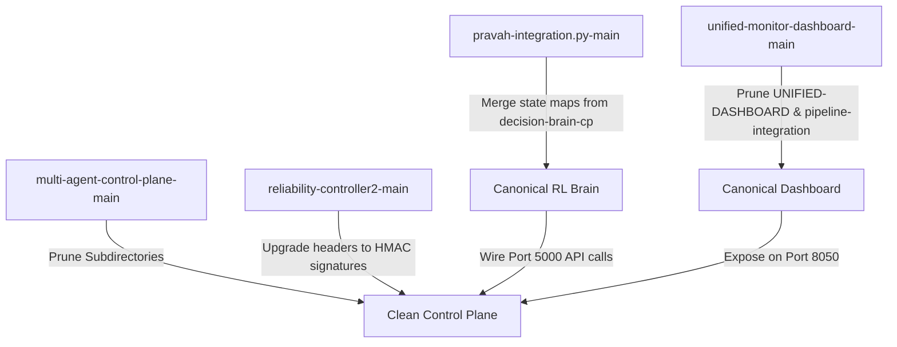

# PRAVAH SYSTEM DOSSIER: CENSUS & AUDIT

This dossier contains the official, evidence-backed census and architectural audit of the Pravah ecosystem found in the workspace (`c:/Users/black/OneDrive/Desktop/Pravah/BHIV`). Every claim below is mapped to specific code files and structures with their exact file paths, ports, and configuration keys.

---

## Workspace Map & Owner Attribution
We identified **11 distinct repositories/folders** within the workspace. Using the provided owner mappings (*Shivam: control plane; Rayyan: reliability controllers and monitors; Ritesh: enforcement, decision brains, and dashboards*), the attribution is:

* **Shivam (1 repo):** [multi-agent-control-plane-main](file:///c:/Users/black/OneDrive/Desktop/Pravah/BHIV/multi-agent-control-plane-main)
* **Rayyan (3 repos):** [reliability-controller-main](file:///c:/Users/black/OneDrive/Desktop/Pravah/BHIV/reliability-controller-main), [reliability-controller2-main](file:///c:/Users/black/OneDrive/Desktop/Pravah/BHIV/reliability-controller2-main), [monitoring-service-main](file:///c:/Users/black/OneDrive/Desktop/Pravah/BHIV/monitoring-service-main)
* **Ritesh (7 repos):** [SAARTHI-ENFORCEMENT.PY-main](file:///c:/Users/black/OneDrive/Desktop/Pravah/BHIV/SAARTHI-ENFORCEMENT.PY-main), [saartthi-integration.py-main](file:///c:/Users/black/OneDrive/Desktop/Pravah/BHIV/saartthi-integration.py-main), [decision-brain-cp.py-main](file:///c:/Users/black/OneDrive/Desktop/Pravah/BHIV/decision-brain-cp.py-main), [pravah-integration.py-main](file:///c:/Users/black/OneDrive/Desktop/Pravah/BHIV/pravah-integration.py-main), [pipeline-integration-py-main](file:///c:/Users/black/OneDrive/Desktop/Pravah/BHIV/pipeline-integration-py-main), [UNIFIED-DASHBOARD.PY-main](file:///c:/Users/black/OneDrive/Desktop/Pravah/BHIV/UNIFIED-DASHBOARD.PY-main), [unified-monitor-dashboard-main](file:///c:/Users/black/OneDrive/Desktop/Pravah/BHIV/unified-monitor-dashboard-main)

---

## 1. Multi-Agent Control Plane (Converged Edition)
* **System Name:** Multi-Agent Control Plane
* **Builder / Owner:** Shivam
* **Purpose:** Acts as the primary autonomous orchestration coordinator. It senses system state, performs governance and security validations, creates cryptographic state lineage contracts, executes container adjustments, and monitors outcome feedback.
* **Architecture Summary:** 
  * Decentralized loop structure composed of a FastAPI backend ([main.py](file:///c:/Users/black/OneDrive/Desktop/Pravah/BHIV/multi-agent-control-plane-main/control_plane/backend/app/main.py) on Port `8000`), a Redis event bus on Port `6379`, local deployment scale workers ([multi_deploy_agent.py](file:///c:/Users/black/OneDrive/Desktop/Pravah/BHIV/multi-agent-control-plane-main/control_plane/agents/multi_deploy_agent.py)), and Streamlit visualization servers on Ports `8501`/`8502`.
  * An autonomous agent execution service ([agent_runtime.py](file:///c:/Users/black/OneDrive/Desktop/Pravah/BHIV/multi-agent-control-plane-main/agent_runtime.py)) runs a continuous sense-validate-decide-enforce-act-observe-explain FSM loop.
* **Repo / Location:** [multi-agent-control-plane-main](file:///c:/Users/black/OneDrive/Desktop/Pravah/BHIV/multi-agent-control-plane-main)
* **Execution Status:** Fully operational and testable.
* **Runtime Status:** Can be run locally via `control_plane.backend.app.main:app` (FastAPI) and `agent_runtime.py` (autonomous cycle). Includes a runnable test harness ([e2e_integration_test.py](file:///c:/Users/black/OneDrive/Desktop/Pravah/BHIV/multi-agent-control-plane-main/e2e_integration_test.py)).
* **Integration Status:** High. Integrates with the Rayyan Executor service (Port `5003`), logs telemetry status to `/control-plane/runtime-ingest` (FastAPI), and queries an external decision engine (mocked on Port `5000` via [dashboard.py](file:///c:/Users/black/OneDrive/Desktop/Pravah/BHIV/pipeline-integration-py-main/dashboard.py)).
* **Replay Maturity:** High. Implements cryptographic lineage journals (`trace_log.jsonl`) and exposes endpoints `/api/lineage/{execution_id}` and `/api/lineage/{execution_id}/verify` to replay actions and verify transition integrity.
* **Observability Maturity:** High. Emits structured state logs, active dashboard payloads `/live-dashboard`, and verifies execution FSM transitions.
* **Deployment Maturity:** High. Includes local Docker Compose configurations ([docker-compose.yml](file:///c:/Users/black/OneDrive/Desktop/Pravah/BHIV/multi-agent-control-plane-main/docker-compose.yml)) and Render configurations ([render.yaml](file:///c:/Users/black/OneDrive/Desktop/Pravah/BHIV/multi-agent-control-plane-main/render.yaml)).
* **Known Risks:** The system maintains two separate decision paths:
  1. API-driven loop: Ingestion -> Local deterministic thresholds -> Executor.
  2. Autonomous FSM loop: `agent_runtime.py` -> external decision API (Port `5000`) -> cryptographic signatures -> Executor.
  This duality creates architectural bifurcation and increases configuration drift.
* **Current Constitutional Positioning:** Central Orchestration Authority.
* **Duplicate / Overlap Analysis:** Contains a nested duplicate copy of Rayyan's `reliability-controller2-main` directory.
* **Recommendation:** **KEEP** as the core orchestration plane. Full convergence should proceed by consolidating the duplicate subdirectory, replacing the Port `5000` mock decision endpoint with a real connection to Ritesh's RL Brain, and pruning the legacy Streamlit UIs.

---

## 2. Distributed Reliability Controller (V1)
* **System Name:** Distributed Reliability Controller
* **Builder / Owner:** Rayyan
* **Purpose:** Legacy distributed health controller implementing failure classification, cooldown gating, and wait/restart/escalate actions.
* **Architecture Summary:** Designed as a Python Flask app calling submodules under `controller/` (state, detector, decision, executor, monitor).
* **Repo / Location:** [reliability-controller-main](file:///c:/Users/black/OneDrive/Desktop/Pravah/BHIV/reliability-controller-main)
* **Execution Status:** **BROKEN / INCOMPLETE**. Core logic files are missing: `controller/state.py`, `controller/detector.py`, and `controller/decision.py` are absent, causing runtime crashes on launch.
* **Runtime Status:** Non-functional.
* **Integration Status:** None.
* **Replay Maturity:** None.
* **Observability Maturity:** Low. Specifies standard Prometheus-style metrics `/metrics` and a mathematical Stability Score: `100 - (failures * 2) + (recoveries * 3)`.
* **Deployment Maturity:** Medium. Contains a basic `Dockerfile` and Kubernetes configurations under `k8s/` (`deployment.yaml`, `service.yaml`).
* **Known Risks:** Missing files render this codebase unusable.
* **Current Constitutional Positioning:** Obsolete prototype.
* **Duplicate / Overlap Analysis:** Direct precursor to the multi-service system built in `reliability-controller2-main`.
* **Recommendation:** **DEPRECATE**. Remove to prevent confusing developers.

---

## 3. Reliability / Live Observability Stream (V2)
* **System Name:** Reliability Controller v2 (Live Observability Stream)
* **Builder / Owner:** Rayyan
* **Purpose:** Multi-service application and execution infrastructure that validates trace-linked event streams, caller headers, and automated Docker/Kubernetes container restarts.
* **Architecture Summary:** Decoupled system of 4 Flask apps: 
  * `web1` (Port `5001`) and `web2` (Port `5002`): user-facing web apps.
  * `monitor` (Port `5004`): Aggregates events, validates schemas, and exposes Server-Sent Events (SSE) `/signals/stream`.
  * `sarathi` (Port `5005:5001`): policy decision gateway.
  * `executer` (Port `5003`): signs and executes docker/k8s actions.
* **Repo / Location:** [reliability-controller2-main](file:///c:/Users/black/OneDrive/Desktop/Pravah/BHIV/reliability-controller2-main)
* **Execution Status:** Fully operational. Includes a detailed handoff execution guide ([HANDOVER_EXECUTION_FLOW.md](file:///c:/Users/black/OneDrive/Desktop/Pravah/BHIV/reliability-controller2-main/HANDOVER_EXECUTION_FLOW.md)) and testing script ([handover_demo.sh](file:///c:/Users/black/OneDrive/Desktop/Pravah/BHIV/reliability-controller2-main/handover_demo.sh)).
* **Runtime Status:** Active and run-ready.
* **Integration Status:** High. Uses header validations (`X-CALLER: sarathi`) and strict trace-ID propagation (`X-TRACE-ID`) between components.
* **Replay Maturity:** Low. Traces events through FIFO queues and provides mathematical proof of trace isolation ([CONCURRENCY_PROOF.md](file:///c:/Users/black/OneDrive/Desktop/Pravah/BHIV/reliability-controller2-main/CONCURRENCY_PROOF.md)), but lacks persistent database-backed replay.
* **Observability Maturity:** High. Emits real-time observability signals via SSE streams.
* **Deployment Maturity:** High. Includes Kubernetes configurations in `k8s/` (NodePorts, RBAC ClusterRole bindings) and a local `docker-compose.yml`.
* **Known Risks:** Port conflict when running locally without containers: `web1` and `sarathi` both default to Port `5001` in their source codes. Also, header-based auth (`X-CALLER`) is vulnerable to spoofing unless proxied.
* **Current Constitutional Positioning:** Runtime Target, Metrics Stream, and Action Executor.
* **Duplicate / Overlap Analysis:** Exists in duplicate: once at the workspace root and once nested under Shivam's control plane.
* **Recommendation:** **KEEP & CONSOLIDATE**. Merge this codebase as the official execution and monitoring subsystem of the central control plane, resolve the Port `5001` conflict, and enforce the cryptographic signatures built in Shivam's CP instead of the plain header-based `X-CALLER` checks.

---

## 4. Containerized Monitoring Service
* **System Name:** Containerized Monitoring Service
* **Builder / Owner:** Rayyan
* **Purpose:** Simple single-service monitoring prototype that runs a background health-check loop and handles manual failure injections.
* **Architecture Summary:** A Flask app (Port `5000`) starting an internal daemon thread `monitor_service()` that polls a local boolean `failure_state` and performs self-healing simulation.
* **Repo / Location:** [monitoring-service-main](file:///c:/Users/black/OneDrive/Desktop/Pravah/BHIV/monitoring-service-main)
* **Execution Status:** Operational.
* **Runtime Status:** Functional on Port `5000`.
* **Integration Status:** Low (fully self-contained, no external services).
* **Replay Maturity:** None.
* **Observability Maturity:** Medium. Basic health/metrics endpoints and stdout JSON logging.
* **Deployment Maturity:** Medium. Dockerfile and Kubernetes manifests with basic liveness/readiness probes.
* **Known Risks:** Too primitive; does not check real environment states.
* **Current Constitutional Positioning:** Standalone prototype.
* **Duplicate / Overlap Analysis:** Superseded entirely by the distributed controller setup in `reliability-controller2-main`.
* **Recommendation:** **DEPRECATE**. Keep only as a reference model for simple self-healing patterns.

---

## 5. Sarathi Enforcement PoC
* **System Name:** Sarathi Enforcement PoC
* **Builder / Owner:** Ritesh
* **Purpose:** Deterministic policy gatekeeper prototype showing that executors must reject requests that bypass the Sarathi policy engine.
* **Architecture Summary:** Three Flask/FastAPI services: `sarathi` (Port `8000` / `/decision`), `core` (Port `8002` / `/invoke`), and `executer` (Port `8001` / `/execute`).
* **Repo / Location:** [SAARTHI-ENFORCEMENT.PY-main](file:///c:/Users/black/OneDrive/Desktop/Pravah/BHIV/SAARTHI-ENFORCEMENT.PY-main)
* **Execution Status:** Operational via manual test scripts.
* **Runtime Status:** Functional.
* **Integration Status:** Medium. Validates requests via Pydantic schemas and enforces headers.
* **Replay Maturity:** None.
* **Observability Maturity:** Low. Basic logs and stdout prints.
* **Deployment Maturity:** Low (no Docker files).
* **Known Risks:** Relies on plain headers (`X-CALLER: sarathi`) for trust.
* **Current Constitutional Positioning:** Policy enforcement prototype.
* **Duplicate / Overlap Analysis:** Completely duplicated by `saartthi-integration.py-main`.
* **Recommendation:** **DEPRECATE** this folder in favor of `saartthi-integration.py-main`.

---

## 6. Sarathi Enforcement Integration
* **System Name:** Sarathi Enforcement Integration
* **Builder / Owner:** Ritesh
* **Purpose:** An integration-ready expansion of the Sarathi Enforcement PoC incorporating workspace integration notes.
* **Architecture Summary:** Identical tri-service architecture as `SAARTHI-ENFORCEMENT.PY-main`.
* **Repo / Location:** [saartthi-integration.py-main](file:///c:/Users/black/OneDrive/Desktop/Pravah/BHIV/saartthi-integration.py-main)
* **Execution Status:** Operational.
* **Runtime Status:** Functional.
* **Integration Status:** Medium. Contains specific integration folders (`artifacts/shivam/` and `artifacts/rayyan/`).
* **Replay Maturity:** None.
* **Observability Maturity:** Medium. Contains basic dashboard, curl scripts, and verification procedures.
* **Deployment Maturity:** Low.
* **Known Risks:** Shares identical code and port configs with the other PoC, causing port conflicts.
* **Current Constitutional Positioning:** Governance integration sandbox.
* **Duplicate / Overlap Analysis:** Direct duplicate of the code inside `SAARTHI-ENFORCEMENT.PY-main`.
* **Recommendation:** **MERGE** the integration artifacts into the primary control plane repository, then delete this directory.

---

## 7. Decision Brain / RL Engine (In-Memory CP Edition)
* **System Name:** Decision Brain (In-Memory Edition)
* **Builder / Owner:** Ritesh
* **Purpose:** Reinforcement learning decision prototype that processes Shivam's control plane telemetry schema and generates actions.
* **Architecture Summary:** Implements state mapping, rules-based fallback decisions, in-memory Q-tables, safety guards, and environment rate limits.
* **Repo / Location:** [decision-brain-cp.py-main](file:///c:/Users/black/OneDrive/Desktop/Pravah/BHIV/decision-brain-cp.py-main)
* **Execution Status:** Operational via integration tests.
* **Runtime Status:** Standalone scripts.
* **Integration Status:** High. Uses clients ([telemetry.py](file:///c:/Users/black/OneDrive/Desktop/Pravah/BHIV/decision-brain-cp.py-main/decision_brain/telemetry.py), [orchestrator.py](file:///c:/Users/black/OneDrive/Desktop/Pravah/BHIV/decision-brain-cp.py-main/decision_brain/orchestrator.py)) configured to call control plane endpoints.
* **Replay Maturity:** Medium (tracks decision histories inside `AppStateStore`).
* **Observability Maturity:** Medium. Includes a static HTML/JS visualization dashboard (`dashboard.html`).
* **Deployment Maturity:** Low.
* **Known Risks:** Q-table data resides strictly in RAM and is lost on process restart.
* **Current Constitutional Positioning:** Decision logic sandbox.
* **Duplicate / Overlap Analysis:** Overlaps directly with `pravah-integration.py-main`.
* **Recommendation:** **MERGE** with `pravah-integration.py-main` to consolidate the RL engine logic.

---

## 8. Pravah Hardened Autonomous DevOps Engine (RL Brain)
* **System Name:** Pravah Hardened RL Engine
* **Builder / Owner:** Ritesh
* **Purpose:** Production-safe, persistent reinforcement learning decision engine that manages multi-application telemetry signals.
* **Architecture Summary:** FastAPI app exposing `/q-table` and `/deployments`. Runs a background `AutonomyLoop` that encodes metrics, updates a JSON Q-table ([q_table_store.py](file:///c:/Users/black/OneDrive/Desktop/Pravah/BHIV/pravah-integration.py-main/rl/q_table_store.py)), enforces cooldowns, and executes actions.
* **Repo / Location:** [pravah-integration.py-main](file:///c:/Users/black/OneDrive/Desktop/Pravah/BHIV/pravah-integration.py-main)
* **Execution Status:** Operational.
* **Runtime Status:** Active on FastAPI lifespan (Port `8000`).
* **Integration Status:** High. Uses HTTP client wrappers to fetch metrics and execute actions.
* **Replay Maturity:** Medium (persists the Q-table to `data/q_table.json`).
* **Observability Maturity:** High. Exposes `/q-table` status API and includes an interactive HTML dashboard.
* **Deployment Maturity:** Low (no Docker files).
* **Known Risks:** Explorer rate $\epsilon = 0.1$ and Q-table updates are permitted in `DEV` environment only, preventing staging/production drift but limiting production learning capacity.
* **Current Constitutional Positioning:** Primary Reinforcement Learning Decision Engine.
* **Duplicate / Overlap Analysis:** Shares core logic with `decision-brain-cp.py-main`.
* **Recommendation:** **KEEP & MERGE**. This should be designated as the official, canonical "Pravah RL Decision Brain". Merge the mapping schemas from `decision-brain-cp.py-main` into it.

---

## 9. Pipeline Integration & Dashboard
* **System Name:** Pipeline Integration Server
* **Builder / Owner:** Ritesh
* **Purpose:** Serves as the operational bridge for the current integrated demo, providing rule-based decisions, dampening checks, and environment rate limits.
* **Architecture Summary:** Flask application running on Port `5000`. Exposes `/process-runtime` (which currently serves a mock decision response for `agent_runtime.py`) and `/execute-action`.
* **Repo / Location:** [pipeline-integration-py-main](file:///c:/Users/black/OneDrive/Desktop/Pravah/BHIV/pipeline-integration-py-main)
* **Execution Status:** Operational.
* **Runtime Status:** Functional (Port `5000`).
* **Integration Status:** Critical (acts as the current decision mock backend for `agent_runtime.py`).
* **Replay Maturity:** Low.
* **Observability Maturity:** High (includes HTML templates for dark-theme pipeline telemetry views).
* **Deployment Maturity:** Low.
* **Known Risks:** Contains a hardcoded absolute file path:
  `LOG_FILE = r"C:\Users\spal4\Desktop\SHIVAM\BHIV\multi-agent-control-plane-main\logs\dev\rl_execution_feedback.jsonl"`
  This path references a directory on a different user's machine (`spal4`), which causes file system crashes on other deployment environments.
* **Current Constitutional Positioning:** Mock Decision and Execution Service.
* **Duplicate / Overlap Analysis:** Overlaps functionally with other Flask dashboards in the workspace.
* **Recommendation:** **REFACTOR & MERGE**. The hardcoded path must be resolved. The `/process-runtime` endpoint must be updated to call Ritesh's real RL Engine (`pravah-integration.py-main`) instead of returning mock JSON.

---

## 10. Unified Dashboard PoC
* **System Name:** Unified Dashboard PoC
* **Builder / Owner:** Ritesh
* **Purpose:** Basic visualization of system metrics.
* **Architecture Summary:** Flask server on Port `5000` loading simple templates.
* **Repo / Location:** [UNIFIED-DASHBOARD.PY-main](file:///c:/Users/black/OneDrive/Desktop/Pravah/BHIV/UNIFIED-DASHBOARD.PY-main)
* **Execution Status:** Operational.
* **Runtime Status:** Functional.
* **Integration Status:** Low.
* **Replay Maturity:** None.
* **Observability Maturity:** Medium.
* **Deployment Maturity:** Low.
* **Known Risks:** Lacks the advanced telemetry ingestion interfaces present in V2.
* **Current Constitutional Positioning:** Visualizer sandbox.
* **Duplicate / Overlap Analysis:** Direct duplicate of the files inside `unified-monitor-dashboard-main`.
* **Recommendation:** **DEPRECATE** in favor of `unified-monitor-dashboard-main`.

---

## 11. Unified Infrastructure Monitoring Dashboard (V2)
* **System Name:** Unified Infrastructure Monitoring Dashboard
* **Builder / Owner:** Ritesh
* **Purpose:** Unified visualization panel aggregating telemetry, decision logs, and execution states from the control plane and decision engines.
* **Architecture Summary:** Flask dashboard (Port `5000`) that wraps a thread-safe `UnifiedInfrastructureSystem` collector and exposes API endpoints `/api/status`, `/api/telemetry/ingest`, and `/api/apps/register`.
* **Repo / Location:** [unified-monitor-dashboard-main](file:///c:/Users/black/OneDrive/Desktop/Pravah/BHIV/unified-monitor-dashboard-main)
* **Execution Status:** Operational.
* **Runtime Status:** Functional.
* **Integration Status:** High (designed to receive telemetry from external monitors).
* **Replay Maturity:** Medium (maintains in-memory lists of recent decision outcomes).
* **Observability Maturity:** High (includes custom CSS dark-mode dashboard showing health states, CPU/Memory progress bars, and execution timelines).
* **Deployment Maturity:** Low.
* **Known Risks:** Binds to Port `5000`, causing conflicts with other dashboards in the workspace.
* **Current Constitutional Positioning:** Primary Monitoring UI.
* **Duplicate / Overlap Analysis:** Conceptual duplicate of `UNIFIED-DASHBOARD.PY-main`.
* **Recommendation:** **KEEP & MERGE**. Replace the legacy Streamlit pages in Shivam's control plane with this custom, light-weight HTML dashboard. Bind it to Port `8050` to avoid conflicts.

---

## Duplication & Overlap Matrix

| Repo/System Folder | Overlaps With | Core Reason for Overlap | Convergence Recommendation |
| :--- | :--- | :--- | :--- |
| **reliability-controller-main** | `reliability-controller2-main` | Older, broken version of the reliability app. | **Deprecate** |
| **SAARTHI-ENFORCEMENT.PY-main** | `saartthi-integration.py-main` | Identical codebase without integration notes. | **Deprecate** |
| **UNIFIED-DASHBOARD.PY-main** | `unified-monitor-dashboard-main` | Identical dashboard templates with fewer features. | **Deprecate** |
| **decision-brain-cp.py-main** | `pravah-integration.py-main` | Both represent RL decision sandboxes. | **Merge** into `pravah-integration.py-main` |
| **pipeline-integration-py-main** | `unified-monitor-dashboard-main` | Both run dashboards on Port 5000 with mock engines. | **Refactor** path errors and **merge** |

---

## Step-by-Step Convergence Plan

1. **Pruning Legacy Sandboxes:** Delete the broken `reliability-controller-main`, duplicate `SAARTHI-ENFORCEMENT.PY-main`, and basic `UNIFIED-DASHBOARD.PY-main`.
2. **Consolidate the RL Engine:** Merge the state schemas and configurations of `decision-brain-cp.py-main` into `pravah-integration.py-main` (the persistent JSON Q-table engine).
3. **Resolve Path Errors in Dashboard:** Fix the hardcoded username path `C:\Users\spal4\Desktop\...` in `pipeline-integration-py-main/dashboard.py`.
4. **Wire the Autonomous Loop:** Update the mock decision endpoint on Port `5000` to query the real `pravah-integration.py-main` FastAPI engine on Port `8000`.
5. **Harmonize Dashboard UI:** Integrate `unified-monitor-dashboard-main` as the official visual frontend of the Control Plane, running it on Port `8050` instead of Port `5000` to prevent localhost conflicts.
