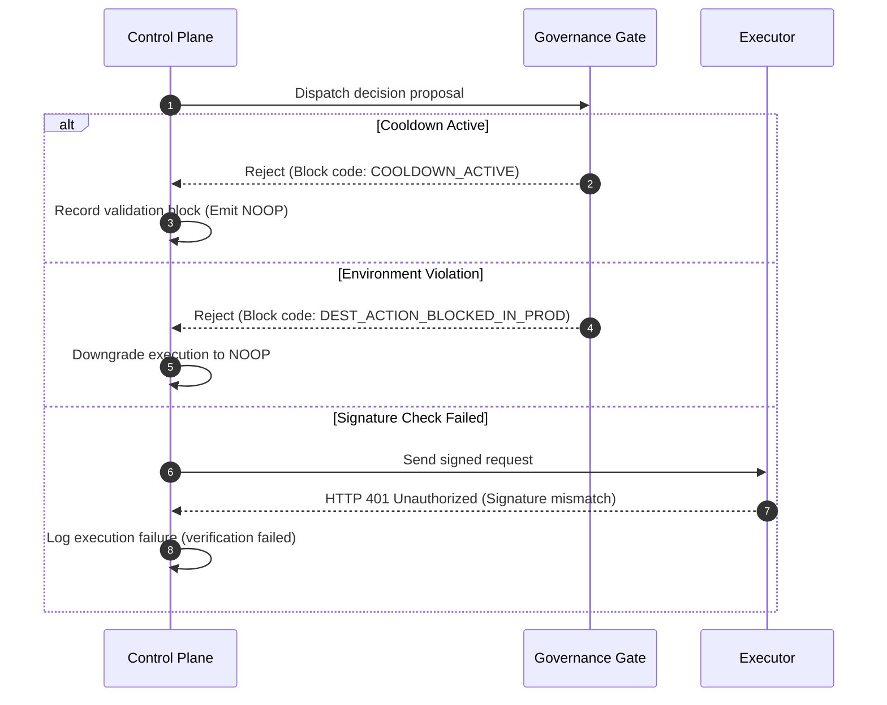

# PRAVAH TANTRA INTEGRATION PLAN

**Status:** Technical Integration Blueprint
**Audience:** Shivam Pal, Rayyan, Ritesh Yadav

This integration plan details the roadmap to wire the **Pravah Autonomous Control Plane** into the **TANTRA Telemetry and Execution Pipeline**. It establishes a unified, non-isolated 8-stage operational chain:

$$\text{Signal} \longrightarrow \text{Intelligence} \longrightarrow \text{Decision} \longrightarrow \text{Contract} \longrightarrow \text{Enforcement} \longrightarrow \text{Execution} \longrightarrow \text{Truth} \longrightarrow \text{Observability}$$

---

## 1. Unified 8-Stage Architectural Chain

```
[Target Services] ──(Telemetry Events)──> [Monitor Aggregator]
                                                  │
                                                  ▼ (Stage 1: Signal)
                                           [TANTRA SSE Stream]
                                                  │
                                                  ▼ (Stage 2: Intelligence)
                                           [Pravah Control Plane]
                                                  │
                                                  ▼ (Stage 3: Decision)
                                            [RL Decision Brain]
                                                  │
                                                  ▼ (Stage 4: Contract)
                                           [Execution Contracts]
                                                  │
                                                  ▼ (Stage 5: Enforcement)
                                            [Action Governance]
                                                  │
                                                  ▼ (Stage 6: Execution)
                                            [Rayyan Executor]
                                                  │
                                                  ▼ (Stage 7: Truth)
                                           [Cryptographic Ledger]
                                                  │
                                                  ▼ (Stage 8: Observability)
                                            [Unified Dashboard]
```

### Stage 1: Signal (OTel Telemetry)
* **Action:** Target services (like [web1](file:///c:/Users/black/OneDrive/Desktop/Pravah/BHIV/reliability-controller2-main/web1/app.py) or `web2`) experience failure states or user activities and post telemetry events containing UUID `trace_id` headers to the [monitor](file:///c:/Users/black/OneDrive/Desktop/Pravah/BHIV/reliability-controller2-main/monitor/app.py) service (`POST /track-event`).
* **Output:** The monitor aggregates raw events and translates them into a strict flat signal conforming to the [TANTRA Signal Schema](file:///c:/Users/black/OneDrive/Desktop/Pravah/BHIV/reliability-controller2-main/signal_schema.json).

### Stage 2: Intelligence (Telemetry Parsing & Encoding)
* **Action:** Pravah's control plane backend pulls signals from the SSE stream and routes them to perception adapters.
* **Output:** Raw fractional variables (e.g. `0.95` CPU) are multiplied by `100` (`95.0`) and encoded by Ritesh's State Encoder into discrete environment states (`normal`, `overloaded`, `degraded`, `crashed`).

### Stage 3: Decision (Reinforcement Learning)
* **Action:** The encoded state is evaluated by the persistent Q-table agent ([rl_agent.py](file:///c:/Users/black/OneDrive/Desktop/Pravah/BHIV/pravah-integration.py-main/rl/rl_agent.py)).
* **Output:** The agent chooses the highest-value action (e.g., `scale_up`, `restart`, `noop`) and records a decision log.

### Stage 4: Contract (Linage Construction)
* **Action:** The control plane constructs a **Decision Contract** wrapping the decision parameters.
* **Output:** The contract advances the lineage history, building an immutable **Execution Contract** ([execution_contract.py](file:///c:/Users/black/OneDrive/Desktop/Pravah/BHIV/multi-agent-control-plane-main/contracts/execution_contract.py)) verifying prior state hashes (`CREATED` -> `APPROVED` -> `EXECUTED` -> `COMPLETED`).

### Stage 5: Enforcement (Governance Verification)
* **Action:** The request passes through safety checks inside the control plane.
* **Output:** Cooldown Managers verify that rate limits are respected (60s cooldown). Action Guards verify environment rules, downgrading restricted executions to `NOOP` (e.g., destructive actions in `PROD`).

### Stage 6: Execution (HMAC-Signed Request)
* **Action:** If approved, the control plane signs the request with HMAC-SHA256 headers (`X-Service-Signature`) and dispatches it to Rayyan's Executor ([executer/app.py](file:///c:/Users/black/OneDrive/Desktop/Pravah/BHIV/reliability-controller2-main/executer/app.py)).
* **Output:** The Executor validates the cryptographic signature, executes container restarts via Docker CLI or kubectl commands, and verifies container health.

### Stage 7: Truth (Cryptographic Attestation)
* **Action:** The execution output is reported back to the control plane.
* **Output:** The control plane appends a block hash to the execution ledger and updates `trace_log.jsonl` to ensure audit integrity.

### Stage 8: Observability (Unified Dashboard Feedback)
* **Action:** The completed transaction and real-time SSE logs are consumed by the visual web dashboard.
* **Output:** The operator dashboard ([dashboard_ui.py](file:///c:/Users/black/OneDrive/Desktop/Pravah/BHIV/unified-monitor-dashboard-main/dashboard_ui.py) on port `8050`) renders metrics, replica bars, and decision lists, while state outcomes are fed back to the RL engine to update Q-table rewards.

---

## 2. Upstream & Downstream Dependencies

### Upstream Tantra Dependencies
Pravah depends on the following upstream interfaces:
1. **[monitor/app.py (Port 5004)](file:///c:/Users/black/OneDrive/Desktop/Pravah/BHIV/reliability-controller2-main/monitor/app.py):** Must publish OTel events converted to flat, strict TANTRA signals.
2. **`signal_schema.json`:** The JSON schema enforcing signal attributes (`signal_type`, `service`, `metric`, `value`, `severity`, `timestamp`, `trace_id`).

### Downstream Tantra Consumers
Pravah serves these downstream components:
1. **[executer/app.py (Port 5003)](file:///c:/Users/black/OneDrive/Desktop/Pravah/BHIV/reliability-controller2-main/executer/app.py):** Receives signed, authorized command requests and applies adjustments to containers.
2. **[dashboard_ui.py (Port 8050)](file:///c:/Users/black/OneDrive/Desktop/Pravah/BHIV/unified-monitor-dashboard-main/dashboard_ui.py):** Consumes live execution logs and decision summaries for visual monitoring.

---

## 3. Core System Integration Flows

### Trace Flow
A single trace ID is generated at the source web service and propagated across the entire pipeline:
```
[web1: X-TRACE-ID]
       │
       ▼ (POST /track-event)
[monitor: trace_id]
       │
       ▼ (SSE stream)
[control-plane: trace_id]
       │
       ▼ (Decide & Contract)
[executer: trace_id]
       │
       ▼ (Write Ledger)
[trace_log.jsonl: trace_id]
```
The trace ID must be maintained as a strict UUID string. Any drop or mutation of this ID will break trace isolation checks and fail verification.

### Schema Flow
Three schemas regulate data shape:
1. **Intake Schema:** Conforms to [signal_schema.json](file:///c:/Users/black/OneDrive/Desktop/Pravah/BHIV/reliability-controller2-main/signal_schema.json).
2. **Decision Contract Schema:** Governs the internal RL interface:
   ```json
   {
     "decision_id": "uuid",
     "selected_action": "string",
     "confidence": 1.0,
     "timestamp": "iso-time"
   }
   ```
3. **Execution Ledger Schema:** Governs state transition lineage logs:
   ```json
   {
     "execution_id": "string",
     "state": "CREATED | APPROVED | EXECUTED | COMPLETED",
     "previous_hash": "sha256",
     "payload_hash": "sha256",
     "signature": "hmac-sha256"
   }
   ```

### Execution Lineage & Replay Flow
1. Decisions are written to cryptographic journals (`trace_log.jsonl`).
2. An operator triggers `/api/lineage/{execution_id}` to retrieve history.
3. The verification API `/api/lineage/{execution_id}/verify` replays the state transitions and checks:
   * State sequence prerequisites (Phase 4 Semantic Transition verification: must go through `CREATED` -> `APPROVED` -> `EXECUTED` -> `COMPLETED`).
   * Hash chain continuity (each record's `previous_hash` must match the parent's `execution_hash`).
   * Invalid transitions or broken chains trigger immediate alarm exceptions.

### Observability & Failure Visibility
* Real-time events are streamed to the dashboard using SSE, avoiding polling loops.
* **Failure Visibility:** Rejections (due to signature mismatches, schema validation failures, or governance blocks) are explicitly recorded as `refused` or `failed` events in the decision history. The dashboard visualizes these blocks as yellow/red alert chips on the application cards.

---

## 4. Rejection & Governance Flow



---

## 5. Integration Verification Checklist

* [ ] Consolidate the nested duplicate `reliability-controller2-main` directory from the control plane root.
* [ ] Parameterize the hardcoded absolute filesystem path in `pipeline-integration-py-main/dashboard.py`.
* [ ] Add a metrics translator to scale CP floats (`0.90`) to percentage variables (`90.0`) at the RL boundary.
* [ ] Re-route `agent_runtime.py` to target the active FastAPI `pravah-integration` service instead of the port 5000 mock.
* [ ] Implement HMAC-SHA256 signature validation headers in the executor service.
* [ ] Re-bind the unified Flask dashboard to Port `8050` to eliminate local port conflicts.
