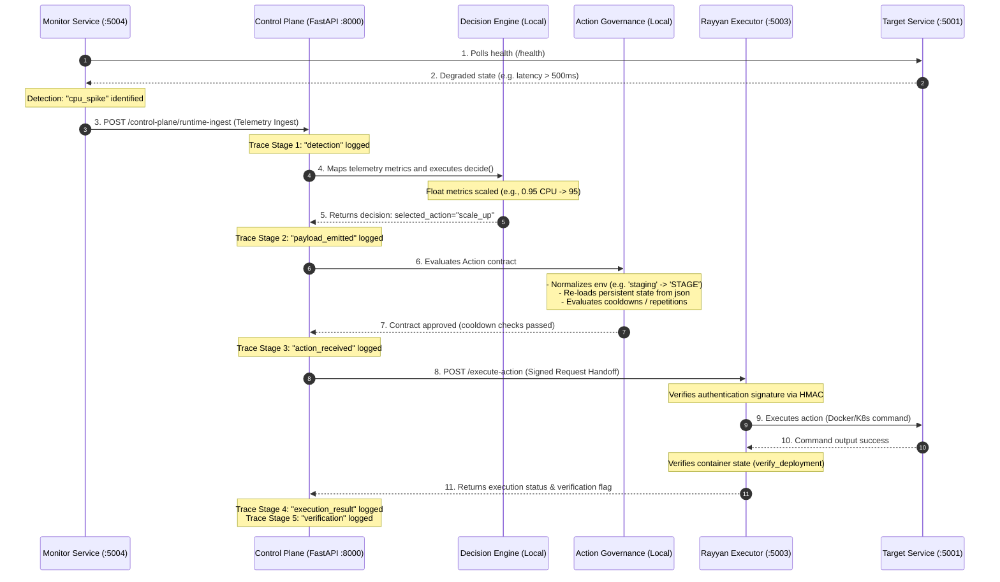

# Control Flow Specification

This document defines the sequential control flow of the converged multi-agent system.



---

## Chronological Flow Breakdown

### 1. Detection (Monitoring Signal Emission)
* **Emitter:** `reliability-controller2-main/monitor/app.py`
* **Trigger:** The monitor polls health endpoints of target services (e.g., `web1` on port `5001`). If latency exceeds 500ms or response codes are non-200, an issue is detected.
* **Payload Shape:**
  ```json
  {
    "service_id": "web1",
    "timestamp": "2026-06-03T20:50:55Z",
    "status": "degraded",
    "metrics": { "cpu": 0.95, "memory": 0.83, "error_rate": 0.0, "uptime": 1780500055 },
    "issue_detected": true,
    "issue_type": "cpu_spike",
    "recommended_action": "scale_up"
  }
  ```

### 2. Ingestion & Decision Engine
* **Receiver:** `control_plane/backend/app/main.py` (`/control-plane/runtime-ingest`)
* **Logging Stage:** `detection` is logged to `trace_log.jsonl`.
* **Action:**
  1. The Control Plane normalizes environment strings using `normalize_environment` (e.g., `"staging"` or `"stage"` becomes `"STAGE"`).
  2. Telemetry ratios are scaled up (e.g. CPU `0.95` becomes `95`).
  3. `DecisionEngine.decide` evaluates the metrics against configured policy thresholds (e.g. `cpu >= 90` -> `scale_up`).
* **Logging Stage:** `payload_emitted` is logged.

### 3. Action Governance Check
* **Check Point:** `ActionGovernance.evaluate_contract`
* **Logging Stage:** `action_received` is logged.
* **Action:**
  1. **Eligibility Rules:** Verifies the action is allowed in the normalized environment (e.g., `scale_up` is allowed in `STAGE` and `DEV`, but not `PROD`).
  2. **Persistence State Sync:** Thread-safely reads `logs/control_plane/governance_state.json` to load past executions.
  3. **Cooldowns & Repetitions:** Blocks the action if it is triggered within the cooldown window (e.g., 120s for `scale_up`) or exceeds repetition frequency limits.
  4. If approved, writes the new event record to `logs/control_plane/governance_state.json`.

### 4. Orchestration & Execution
* **Handoff:** The Control Plane builds signed headers (HMAC SHA256 containing signature, timestamp, nonce, and the target service ID) and POSTs the action payload to Rayyan's Executor (`http://localhost:5003/execute-action`).
* **Execution:** The Executor verifies request authenticity, executes the corresponding command (Docker container restart or scale mock), and inspects host containers (`docker ps` or `kubectl`) to verify the outcome.
* **Logging Stage:** `execution_result` and `verification` are appended to `trace_log.jsonl` upon receiving the response.