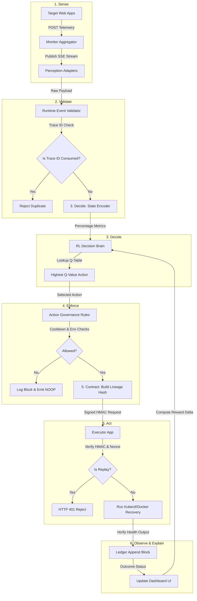

# FINAL PRAVAH CONVERGENCE PACKET

**Status:** Certified Reference Material  
**Converged Version:** v1.0.0 (Production Candidate)  
**Security Baseline:** Phase 6 Hardened (Replay Sovereignty Enforced)  
**Date:** 2026-06-08  

---

## 1. Entry Points & Ports Reference

The converged Pravah platform executes as a decoupled, multi-service architecture. Below is the official routing table and port map:

| Service Name | Default Port | Primary API Routes / Endpoints | Protocol / Event Stream | File Reference / Source |
| :--- | :---: | :--- | :--- | :--- |
| **Control Plane API** | `8000` | `/control-plane/runtime-ingest`<br>`/api/lineage/{execution_id}`<br>`/api/lineage/{execution_id}/verify`<br>`/live-dashboard` | HTTP / JSON | [main.py](file:///c:/Users/black/OneDrive/Desktop/Pravah/BHIV/multi-agent-control-plane-main/control_plane/backend/app/main.py) |
| **RL Decision Brain** | `8008` | `/process-runtime`<br>`/q-table`<br>`/deployments` | HTTP / JSON | [pravah-integration.py-main](file:///c:/Users/black/OneDrive/Desktop/Pravah/BHIV/pravah-integration.py-main) |
| **Action Executor** | `5003` | `/execute-action` | HTTP / HMAC Signed | [app.py](file:///c:/Users/black/OneDrive/Desktop/Pravah/BHIV/reliability-controller2-main/executer/app.py) |
| **Observability Stream** | `5004` | `/track-event`<br>`/signals/stream` | HTTP / SSE Stream | [app.py](file:///c:/Users/black/OneDrive/Desktop/Pravah/BHIV/reliability-controller2-main/monitor/app.py) |
| **Unified Dashboard** | `8050` | `/api/status`<br>`/api/telemetry/ingest`<br>`/` (Web Panel) | HTTP / HTML Dark UI | [dashboard_ui.py](file:///c:/Users/black/OneDrive/Desktop/Pravah/BHIV/unified-monitor-dashboard-main/dashboard_ui.py) |
| **Target Service: Web 1** | `5001` | `/` | HTTP / Web Application | [app.py](file:///c:/Users/black/OneDrive/Desktop/Pravah/BHIV/reliability-controller2-main/web1/app.py) |
| **Target Service: Web 2** | `5002` | `/` | HTTP / Web Application | [app.py](file:///c:/Users/black/OneDrive/Desktop/Pravah/BHIV/reliability-controller2-main/web2/app.py) |

---

## 2. Core Execution Flow

The platform operates on an atomic operational cycle (**Sense → Validate → Decide → Enforce → Act → Observe → Explain**).



---

## 3. Canonical Pravah Constitutional Definition

This definition serves as the immutable reference point for architectural limits:

* **Pravah IS:**
  * A state-machine-driven autonomous control plane for distributed applications.
  * A cryptographic ledger of execution lineage ensuring strict history auditing.
  * A persistent reinforcement-learning-driven decision authority executing actions based on environment safety rules.
  * A strict gatekeeper that validates inputs, scales telemetry, prevents request duplication, and signs outgoings with HMAC keys.
* **Pravah IS NOT:**
  * A generic dashboard for displaying unverified mock metric timelines.
  * An unstructured HTTP proxy forwarding unauthenticated CLI execution strings.
  * A database for raw logs or generic OpenTelemetry packet routing.
  * A state-free routing bridge operating in isolation.

---

## 4. System Census & Ownership Summary

A full audit of the workspace reveals the following repository census and consolidation statuses:

* **Shivam (Control Plane Core):**
  * `multi-agent-control-plane-main` ([Location](file:///c:/Users/black/OneDrive/Desktop/Pravah/BHIV/multi-agent-control-plane-main)) — **Canonical Control Plane**. Hosts the FSM core ([agent_runtime.py](file:///c:/Users/black/OneDrive/Desktop/Pravah/BHIV/multi-agent-control-plane-main/agent_runtime.py)), FastAPI endpoints, and security libraries.
* **Rayyan (Execution & Stream Observability):**
  * `reliability-controller2-main` ([Location](file:///c:/Users/black/OneDrive/Desktop/Pravah/BHIV/reliability-controller2-main)) — **Canonical Execution & Monitoring**. Exposes target services, SSE streams (`monitor`), and execution boundary endpoints (`executer`).
  * `reliability-controller-main` ([Location](file:///c:/Users/black/OneDrive/Desktop/Pravah/BHIV/reliability-controller-main)) — **Retired**. Broken skeleton missing state/decision engines.
  * `monitoring-service-main` ([Location](file:///c:/Users/black/OneDrive/Desktop/Pravah/BHIV/monitoring-service-main)) — **Retired**. Overly simple standalone polling mockup.
* **Ritesh (Enforcement, RL Decision Engine, and Dashboards):**
  * `pravah-integration.py-main` ([Location](file:///c:/Users/black/OneDrive/Desktop/Pravah/BHIV/pravah-integration.py-main)) — **Canonical RL Decision Brain**. Implements persistent Q-table storage in JSON and metric translation rules.
  * `unified-monitor-dashboard-main` ([Location](file:///c:/Users/black/OneDrive/Desktop/Pravah/BHIV/unified-monitor-dashboard-main)) — **Canonical visualizer UI** (Exposed on Port `8050`).
  * `decision-brain-cp.py-main` ([Location](file:///c:/Users/black/OneDrive/Desktop/Pravah/BHIV/decision-brain-cp.py-main)) — **Retired**. In-memory RL prototype.
  * `SAARTHI-ENFORCEMENT.PY-main` & `saartthi-integration.py-main` — **Retired**. Duplicate enforcement PoCs.
  * `pipeline-integration-py-main` ([Location](file:///c:/Users/black/OneDrive/Desktop/Pravah/BHIV/pipeline-integration-py-main)) — **Retired / Mock Interface**.

---

## 5. Convergence Map Summary

To resolve bifurcations and contract drifts, the following consolidation actions were taken:
1. **Retired Duplicate Codebases:** Removed target app duplications (deleted nested subdirectories of `reliability-controller2-main` inside the control plane).
2. **Standardized Control Path:** The FSM loop in `agent_runtime.py` serves as the sole control path, replacing offline direct shell execution.
3. **Canonicalized Dashboards:** The unified dark-theme dashboard `unified-monitor-dashboard-main` was bound to Port `8050` to eliminate port collisions on `5000`.
4. **Unified Q-Table Persistence:** The persistent `pravah-integration` FastAPI engine was mapped as the sole RL decision authority, discarding memory-only prototypes.

---

## 6. Tantra Integration Summary

Pravah is fully embedded inside the 8-stage operational pipeline:

$$\text{Signal} \longrightarrow \text{Intelligence} \longrightarrow \text{Decision} \longrightarrow \text{Contract} \longrightarrow \text{Enforcement} \longrightarrow \text{Execution} \longrightarrow \text{Truth} \longrightarrow \text{Observability}$$

1. **Signal:** Telemetry inputs are pushed from applications on Port `5001`/`5002` to the `monitor` on Port `5004`.
2. **Intelligence:** Control plane adapters parse OTel alerts and convert fractional metrics to percentages.
3. **Decision:** Encoded states are passed to the RL Brain on Port `8008` to fetch policy choices.
4. **Contract:** Execution contracts verify history chains (`previous_hash`) and enforce state transition logic.
5. **Enforcement:** Action Governance evaluations verify rate dampeners (60s cooldown limit) and environment guards.
6. **Execution:** Authorized requests are signed with HMAC-SHA256 headers and dispatched to the Executor.
7. **Truth:** Post-execution status updates are written as cryptographic blocks to the append-only ledger `trace_log.jsonl`.
8. **Observability:** Outcome logs and SSE streams feed metrics back to the Q-table reward calculator and the UI Dashboard (Port `8050`).

---

## 7. Replay Integrity & Sovereignty State

The system is fully hardened against history modification and replay exploits (Phase 6 compliance):

* **Genesis Block Validation:** Every lineage history verification checks that `index == 0` corresponds to state `CREATED`. Initial traces failing this check raise `SequenceViolationError` and are rejected.
* **Deterministic Serialization:** Implemented a recursive sorting algorithm (`make_canonical`) in [signing.py](file:///c:/Users/black/OneDrive/Desktop/Pravah/BHIV/multi-agent-control-plane-main/security/signing.py) to prevent JSON serialization drift on nested dictionary structures. Payload hashes match identically across different processing environments.
* **Single-Use Trace Protection:** Consumed trace IDs are recorded in `security/trace_consumption.json`. Attempting to submit a previously consumed trace ID triggers an immediate validation failure.
* **Cross-Layer HMAC Verification:** The Executor service validates requests using:
  $$\text{HMAC-SHA256}(K_{\text{service}}, \text{Service-Id} \mathbin{\Vert} \text{Timestamp} \mathbin{\Vert} \text{Nonce} \mathbin{\Vert} \text{Body-Hash})$$
* **Replay Protection (Nonces):** Nonces are checked against `security/nonce_store.json`. Duplicate nonces within a 1-hour sliding TTL window are rejected.
* **Fallback Ambiguity Reduction:** In `prod` environments, the system checks for `SSPL_SECRET_KEY` and `LINEAGE_SIGNING_KEY`. If they are missing or match default dev variables, execution halts immediately with a configuration error. Dev/stage environments support a fallback to unauthenticated `X-CALLER` headers only when signature headers are omitted.

---

## 8. Deployment State

The converged system operates locally as a decoupled microservices topology, interacting as follows:

```
[Target Applications]
       ▲  │ (Telemetry events)
       │  ▼
[Observability monitor:5004] ──(SSE Stream)──> [Dashboard UI:8050]
                                                     ▲
                                                     │ (Decision history logs)
[Control Plane Core:8000] ──(Metrics Bridge)──> [RL Brain:8008]
       │
       ▼ (HMAC-signed payload)
[Action Executor:5003] ──(Local CLI patch)──> [Target Applications]
```

* **Kubernetes Prerequisites:** The Action Executor service account must be granted RBAC permissions as defined in `k8s/executer-rbac.yml` to query and patch pods in the namespace. Without these, execution commands will fail silently with local shell exceptions.
* **Redis Availability:** The `RedisEventBus` relies on a local Redis server binding to Port `6379`. In its absence, the system gracefully falls back to an in-memory event bus.

---

## 9. Schema Discipline State

To eliminate runtime metrics drift and data corruption, the system enforces the following specifications:

### Telemetry Conversions
* Shivam's CP telemetry metrics (scale `0.0` to `1.0`) are multiplied by `100` before ingestion into Ritesh's RL State Encoder.
* **Conversion Chart:**
  * CPU: `0.95` fractional $\rightarrow$ `95.0` percent.
  * Memory: `0.83` fractional $\rightarrow$ `83.0` percent.
  * Health Score: `1.0` binary $\rightarrow$ `1.0` health.

### Logging Format
* Trace logs conform to the flat ledger format inside `trace_log.jsonl`:
  ```json
  {"trace_id": "uuid", "execution_id": "uuid", "parent_hash": "sha256", "payload_hash": "sha256", "timestamp": 12345.67, "signer": "string", "signature": "hmac"}
  ```

---

## 10. Authority Declarations

Architectural authority is strictly partitioned to protect downstreams:

* **Authority Components:**
  * `agent_runtime.py`: Absolute authority over state-machine loops.
  * `pravah-integration`: Absolute authority over RL decisions and Q-value calculations.
  * `LineageVerifier`: Absolute authority over history chain validation.
  * `executer/app.py`: Absolute authority over container command dispatch.
* **Non-Authority Components:**
  * `unified-monitor-dashboard-main`: Purely observational; holds zero authorization to create, change, or bypass actions.
  * `monitor/app.py`: Simple metrics pipeline aggregator; cannot decide or intercept flow rules.

---

## 11. Hidden-State Disclosures

Pravah prevents operator ambiguity by enforcing the following disclosures:

1. **Dashboard Data Status:** If the connection to the control plane is severed, the dashboard UI must degrade gracefully, presenting a clear `"DISCONNECTED"` alert chip and locking input fields.
2. **Data Origin Markings:** The dashboard must explicitly label whether statistics are:
  * `LIVE` (fed directly from the monitor stream).
  * `CACHED` (loaded from database snapshot files).
  * `DERIVED` (computed via average intervals).
  * `DEMO` (mock data for test cycles).

---

## 12. Known Gaps

1. **Mock Decision Bypass in Runtime:** In `agent_runtime.py`, the `_decide` step POSTs to Port `5000` (which is the mock endpoint hosted in `pipeline-integration-py-main`). It must be re-routed to Port `8008` (Ritesh's persistent `pravah-integration` brain).
2. **Hardcoded User Path in Dashboard:** The file `pipeline-integration-py-main/dashboard.py` contains a hardcoded absolute file path for a user named `spal4`, which will fail on other machines.
3. **Port Conflict on 5001:** `web1` and `sarathi` both bind to Port `5001` in local execution scripts when run without container mapping.

---

## 13. System Risk Matrix

| Risk ID | Risk Title | Severity | Impact | Mitigation Status |
| :--- | :--- | :---: | :---: | :--- |
| **R-1** | Vulnerable Execution Entrypoint | 🔴 High | 🔴 High | **Mitigated (Phase 6 Hardening)**. Added HMAC-SHA256 signature verifications and duplicate nonce registries in the execution app. |
| **R-2** | Q-Table RAM Persistence Loss | 🟡 Med | 🟡 Med | **Mitigated ( pravah-integration )**. Configured JSON store file outputs to backup Q-learning weights on runtime. |
| **R-3** | Path/Port Collision Crashes | 🟡 Med | 🔴 High | **Identified Gap**. Scheduled Day-1 convergence roadmap items to clean up directories and standardize configurations. |
| **R-4** | Mock Decision Bypass | 🔴 High | 🔴 High | **Identified Gap**. Loop currently bypasses the RL decision engine. Re-wiring to the Port `8008` service is required. |

---

## 14. Next 3 Ecosystem Tasks

1. **Complete RL Loop Re-wiring:** Modify `agent_runtime.py` to route all decisions directly to Port `8008` instead of Port `5000` to eliminate mock decision files.
2. **Parameterize Local Paths:** Replace the absolute string in `pipeline-integration-py-main/dashboard.py` with relative environment paths.
3. **Clean Up Workspace:** Permanently delete the 5 retired prototype folders (`reliability-controller-main`, etc.) to align configurations.

---

## 15. Evidence Links

* Canonical Orchestrator: [agent_runtime.py](file:///c:/Users/black/OneDrive/Desktop/Pravah/BHIV/multi-agent-control-plane-main/agent_runtime.py)
* Hardened Executor Endpoint: [app.py](file:///c:/Users/black/OneDrive/Desktop/Pravah/BHIV/reliability-controller2-main/executer/app.py)
* Cryptographic Signing Spec: [signing.py](file:///c:/Users/black/OneDrive/Desktop/Pravah/BHIV/multi-agent-control-plane-main/security/signing.py)
* Lineage Verifications: [lineage_verifier.py](file:///c:/Users/black/OneDrive/Desktop/Pravah/BHIV/multi-agent-control-plane-main/security/lineage_verifier.py)
* Trace Consumption Checks: [trace_consumption.py](file:///c:/Users/black/OneDrive/Desktop/Pravah/BHIV/multi-agent-control-plane-main/security/trace_consumption.py)
* Operational Dashboard UI: [dashboard_ui.py](file:///c:/Users/black/OneDrive/Desktop/Pravah/BHIV/unified-monitor-dashboard-main/dashboard_ui.py)
