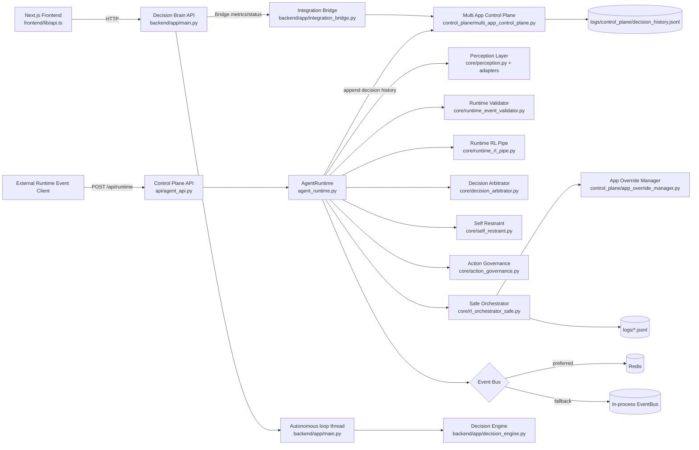
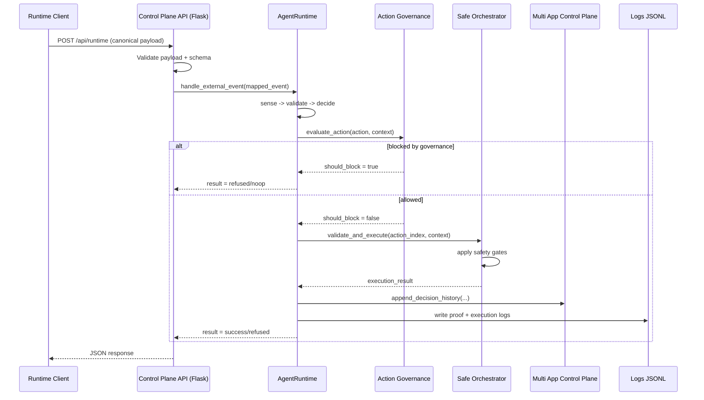
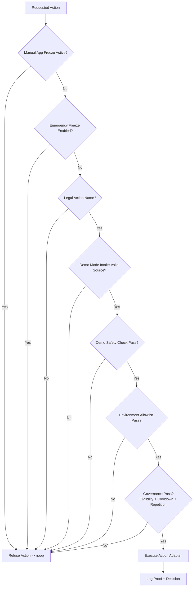

# Current System Architecture (As Implemented)

Date: 2026-03-10

This document reflects the architecture currently implemented in code.

## 1) Runtime Topology

- Control Plane API: Flask app on port 7000 (or CONTROL_PLANE_PORT/PORT)
- Decision Brain API: FastAPI app on port 7999 (or BACKEND_PORT/PORT)
- Frontend: Next.js app on port 3200 by default
- Optional Redis event bus; local in-memory fallback exists

## 2) High-Level Component Diagram

## 3) Request and Decision Flow

### A. Canonical runtime decision path (Control Plane)
1. Client sends runtime payload to Flask endpoint POST /api/runtime.
2. API validates payload using input validator and runtime schema.
3. Payload is transformed into internal event envelope.
4. AgentRuntime runs one synchronous cycle: sense -> validate -> decide -> enforce -> act -> observe -> explain.
5. Decision can be blocked by memory/self-restraint/governance gates.
6. Safe Orchestrator executes only through centralized gated execution.
7. Decision and execution outcomes are logged to JSONL files.
8. Multi-app control-plane history is appended for app timeline and health overview.

### B. Dashboard decision path (Decision Brain)
1. Frontend calls FastAPI endpoints (health, decision, live-dashboard, orchestration metrics).
2. DecisionEngine computes deterministic action from CPU/memory thresholds.
3. Integration bridge stores RL decisions and exposes control-plane integration status.
4. FastAPI startup launches an autonomous loop thread that periodically generates runtime-like decisions and simulated execution state for dashboard visibility.

## 3.1) Sequence Diagram: Canonical Runtime Decision

## 3.2) Flow Diagram: Safety and Governance Gates

## 4) Safety and Governance Layers

Safety checks are layered in this order:
1. Manual per-app freeze (AppOverrideManager)
2. Emergency freeze env gate
3. Illegal action rejection
4. Demo-mode intake gate (source validation)
5. Demo-mode production safety gate
6. Environment action allowlist
7. Action governance (eligibility, cooldown, repetition)

## 5) Data and State Stores

- App registry specs: apps/registry/*.json
- Control-plane history: logs/control_plane/decision_history.jsonl
- App overrides: logs/control_plane/app_overrides.json
- Orchestrator proofs and execution logs: logs/<env>/*.jsonl
- Runtime payload contract: runtime_payload_schema.json
- Agent memory/state snapshots: logs/agent/*
- FastAPI recent decisions/ingested links: in-memory process state (ephemeral)

## 6) Interfaces

### Control Plane API (Flask)
- GET /api/health
- GET /api/status
- POST /api/runtime
- GET /api/control-plane/apps
- GET /api/control-plane/health
- GET /api/control-plane/history/<app_name>
- POST /api/control-plane/override

### Decision Brain API (FastAPI)
- GET /health
- GET /action-scope
- POST /decision
- GET /recent-activity
- GET /live-dashboard
- GET /decision-summary
- POST /decision-with-control-plane
- GET /control-plane/status
- GET /control-plane/apps
- GET /orchestration/metrics
- GET /autonomous-status

## 7) Operational Notes

- The Flask API starts a background AgentRuntime loop at process boot.
- The FastAPI app also starts its own autonomous loop at startup.
- IntegrationBridge instantiates AgentRuntime(env="production") internally; this is separate from the Flask-managed shared runtime instance.
- Redis is optional for event bus behavior; runtime falls back to local EventBus if Redis is unavailable.

## 8) Ports and Entry Points

- Flask control plane: api/agent_api.py
- Gunicorn WSGI entry: wsgi.py
- FastAPI run entry: backend/run.py
- Frontend API client: frontend/lib/api.ts
